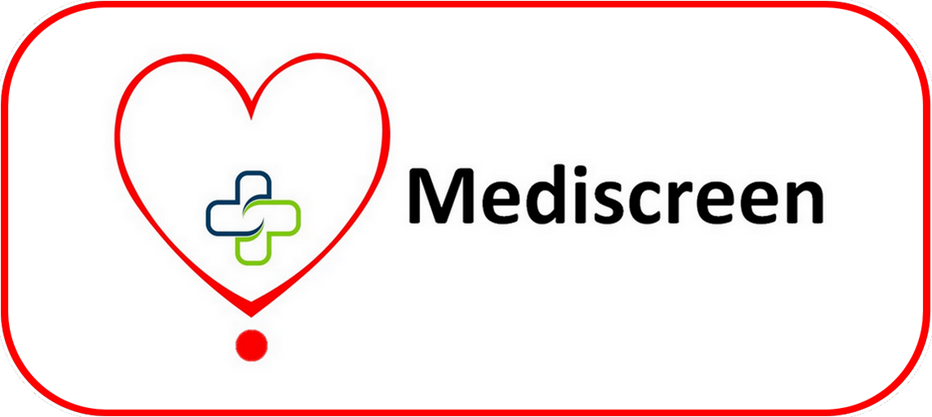
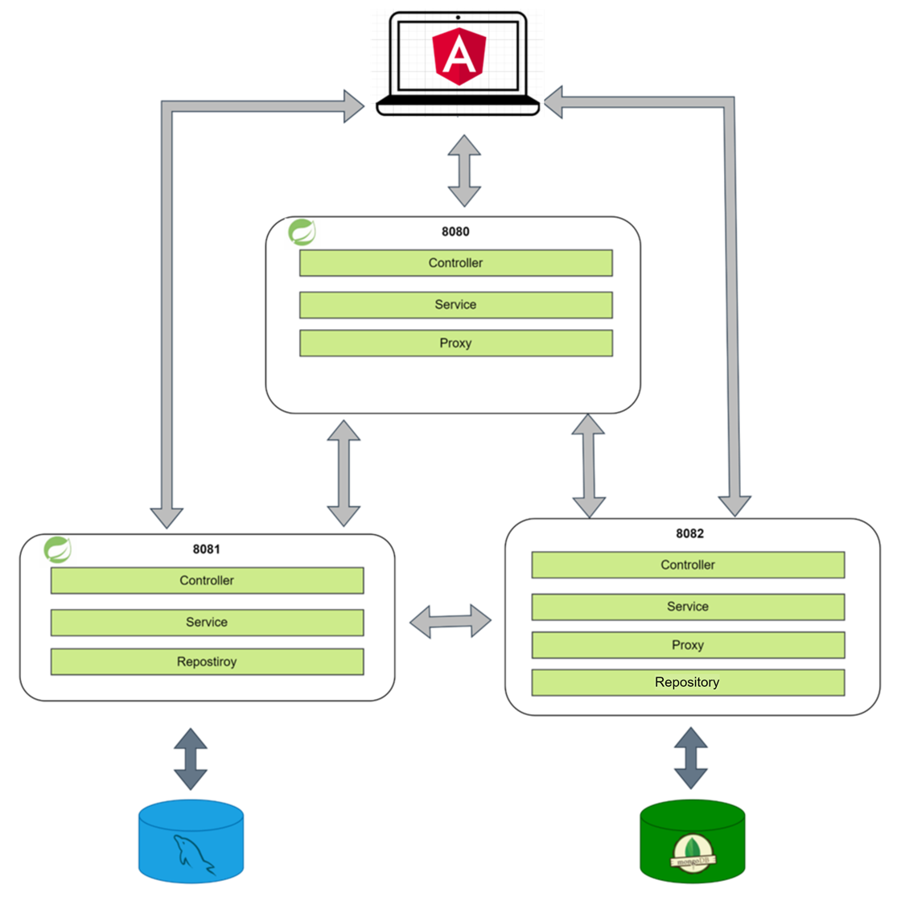
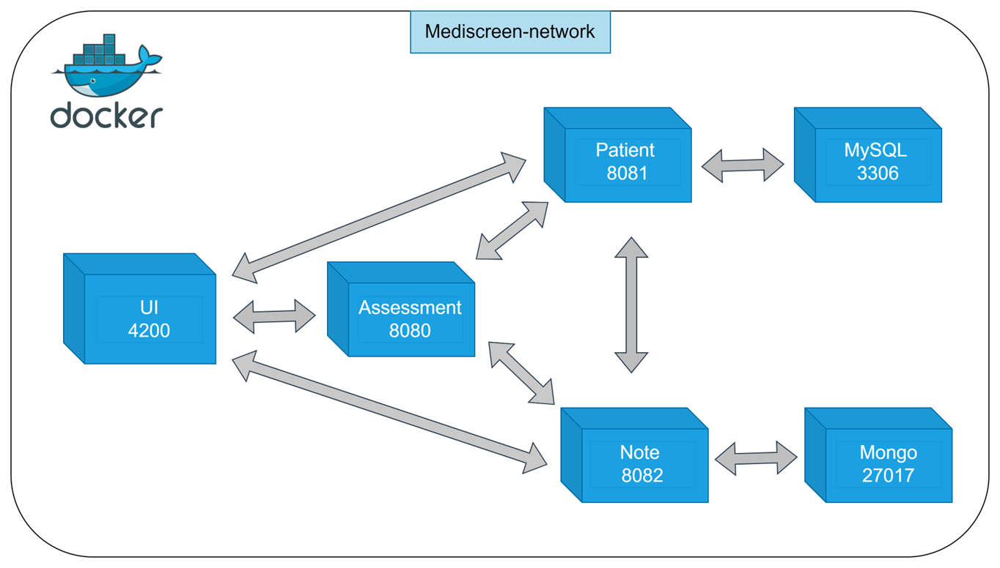
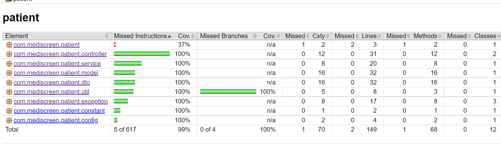
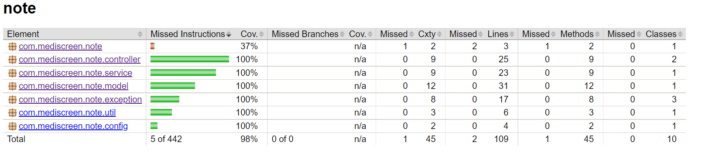
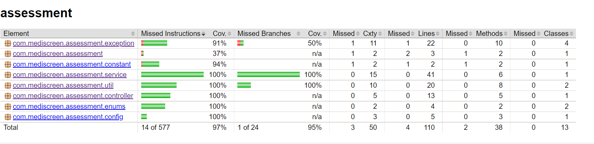

Mediscreen is an application that allows to detect a level of risk of diabetes in a patient, based on his age, his sex and the different notes left by the doctor

---------
## Technical:

1. Angular
2. JAVA 11
3. Maven
4. Spring Boot
5. Spring Data JPA
6. Spring Data MongoDB
7. Spring Cloud openfeign
8. MySQL
9. MongoDB 
10. Docker
11. Agile

---------

## Getting Started

### Running App

To run Mediscreen App:

1. Install docker compose on your station if you don’t have it.
   https://docs.docker.com/compose/install/

3. Build the jar for each microservice by running Build.bat file the command : `Build.bat`
   
4. When all jars are built, perform the command. : `docker-compose up -d`

5. Open the application on the link `http://localhost:4200/`

6. To stop the application run the command : `docker-compose down`

### Testing

- To run the tests for each microservice execute Test.bat with the command: `Test.bat`
- To generate the project's reports site for each microservice execute Create_sites.bat, please run :`Create_sites.bat`

---------
## Architecture

1. Microservice architecture

   

2. Docker architecture

   

---------
## Reports

   

   

   